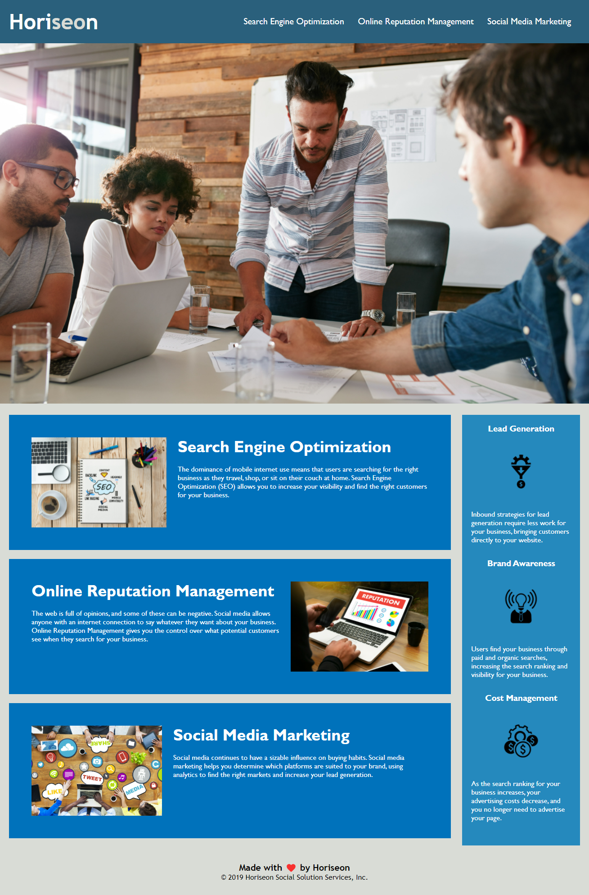

# Web Accessibility & Search Engine Optimization

For this web application, I refactored the existing site to make it more accessible for all users. Also, I organized the code to follow the semantic structure of HTML elements. Organizing the code in such a way makes it much easier to read for other developers that may use this code in the future.

### List of Changes

These are the changes I made to the code to make this site more accessible:

* **Added alt text to imgs**: this ensures that people with disabilities can access the site & avoid any future lawsuits.

* **Added a descriptive title**: giving the SEO page title a more descriptive/branded name will better position the site in search engines.

* **Fixed broken links**: made sure each nav selector worked properly for the user.

* **Restructured the HTML with semantics**: Replacing the divs with specific HTML selector tags helps developers read the code in a more efficient way.

* **Cleaned up repetitive CSS classes**: Combining the CSS classes into one chain helps keep the stylesheet legible.

The following image shows the web application's appearance and functionality:

> **Note**: This layout is designed for desktop viewing, so you may notice that some of the elements don't look like the mock-up at a resolution smaller than 768px. Eventually you'll learn how to make elements responsive so that your web application is optimized for any screen size.

To view this web application, [click here](https://lindsey-lansford.github.io/challenge-1/).